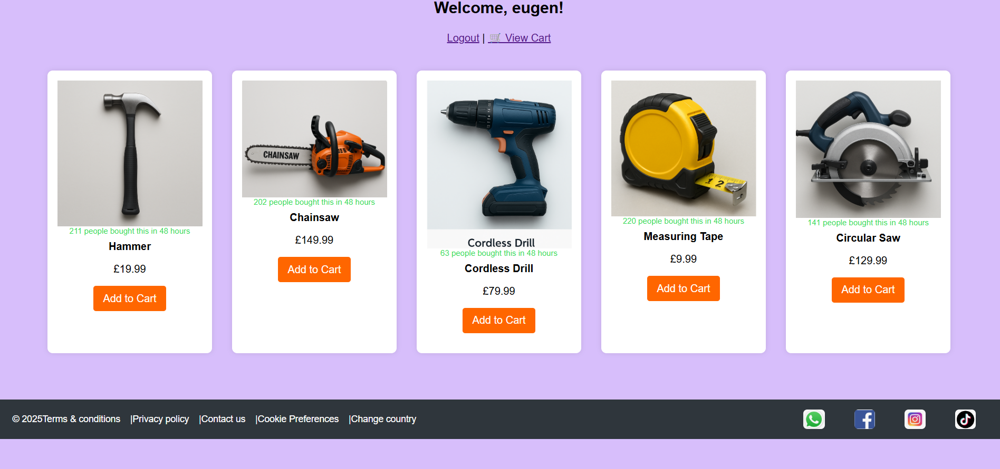

<!-- GitHub Profile README.md -->

<h1 align="center">Hi there, I'm Eugen 👋</h1>

<p align="center">
  <em>Level 5 Computing Student | Frontend Learner | Aspiring Developer</em>
</p>

---

## 🧠 About Me

- 🎓 Currently studying **Level 5 in Computing**
- 💡 Passionate about web development, UI/UX design, and tech innovation
- 📚 Currently learning **JavaScript**, **React**, and backend basics
- 🔧 Tools I enjoy working with: HTML5, CSS3, JS, Git
- 🎯 Goal: Build modern, responsive, user-friendly apps

---

## 🛠️ Projects Showcase

## 🛠️ FixerUpper - Live Demo [Click Here](http://localhost/fixerupper/home.php)

An e-commerce store for tools, built using HTML, CSS, and JavaScript.

### 🏠 Homepage Preview



An intuitive web app where users can shop for tools, add to cart, and proceed to checkout. Built with simplicity and style.


### 📁 Portfolio Web App

My personal portfolio showcasing skills, growth, and projects.

| Portfolio Screenshot |
|----------------------|
|  |

---

## 🧰 Tech Stack

```text
💻 Languages:     HTML, CSS, JavaScript  
⚙️ Tools:         Git, VS Code, GitHub  
🧠 Currently learning: React, Node.js, Firebase  
